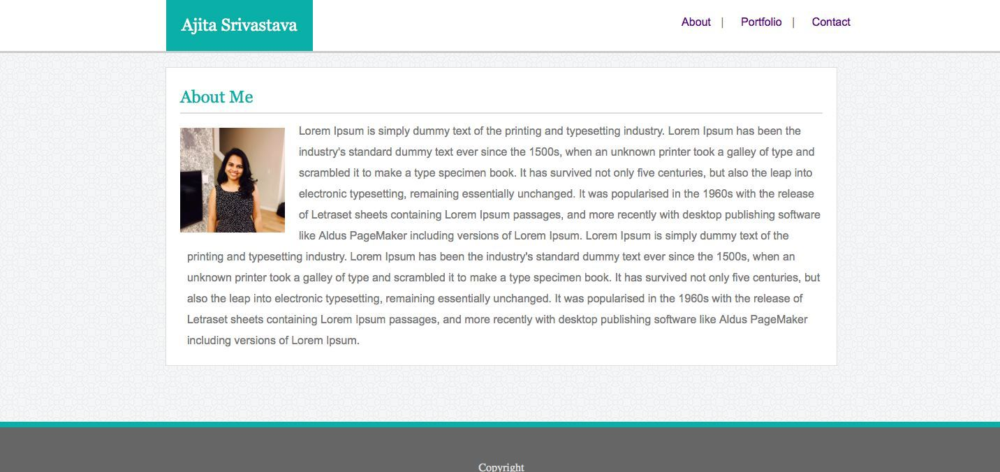

# Basic-Portfolio

<!-- Put a description of what the project is -->
Learning html,css,floats,positioning,pseudo classes,form

## Link to deployed site
<!-- make a link to the deployed site --> 
<!-- [What the user will see](the link to the deployed site) -->
[basic-portfolio](https://ajitas.github.io/Basic-Portfolio/)

## Images
<!-- take a picture of the image and add it into the readme  -->
<!--  -->


## technology used
<!-- make a list of technology used -->
<!-- what you used for this web app, like html css -->

<!-- 
1. First ordered list item
2. Another item
⋅⋅* Unordered sub-list. 
1. Actual numbers don't matter, just that it's a number
⋅⋅1. Ordered sub-list
4. And another item. 
-->
1. HTML
2. CSS
    * float
    * position
    * padding
    * pseudo classes
    * form


## code snippets
<!-- put snippets of code inside ``` ``` so it will look like code -->
<!-- if you want to put blockquotes use a > -->

```
<div class="headingwithnav">
        <header><h2>Ajita Srivastava</h2></header>
        <nav>
            <a href="index.html">About</a> | <a href="portfolio.html">Portfolio</a> | <a href="contact.html">Contact</a>
        </nav>
    </div> 
    <div class="container">
        <div class="PageContent">
            <h2 id="pagecontentheading">Portfolio</h2>
            
                        <div class="portfolioimageswithdesc"> 
                            
                            <div class="descriptionofimage">Antelope Canyon</div>
                        </div>
                   
                        <div class="portfolioimageswithdesc"> 
                            
                            <div class="descriptionofimage">Blue Pond</div>
                        </div>
                        <div class="clearfix"></div>
                
            
                        <div class="portfolioimageswithdesc"> 
                            
                            <div class="descriptionofimage">Desert</div>
                        </div>
  
                        <div class="portfolioimageswithdesc"> 
                            
                            <div class="descriptionofimage">Eagle Waterfall</div>
                        </div>
            
                        <div class="clearfix"></div>
       
            
                        <div class="portfolioimageswithdesc"> 
                            
                            <div class="descriptionofimage">Floating Ice</div>
                        </div>
                        <div class="clearfix"></div>
         
        </div>
    </div>
    <footer>
        Copyright
    </footer>
```
## Learning points
* concept of box model
* positioning of html elements using css float,padding
* using pseudo classes
* using forms and forms elements


## Author 
[Ajita Srivastava](https://github.com/ajitas)

## License
Standard MIT License
